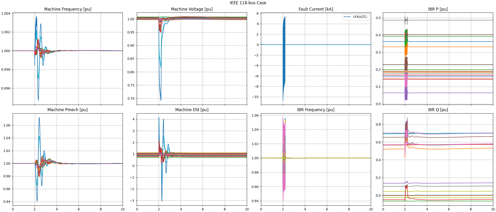

# ATP System Examples

The ATP netlists for _XfmrSat_, _IEEE39_, _IEEE118_, and _WECC240_ examples were created from 
scripts and rawfiles located in the sibling _../../CIM_ directory. Python scripts to convert outputs
to COMTRADE and plot them are located in the sibling _../src_ directory.

To run these examples:

- _go.bat_: Runs ATP from the command line. Edit this file to select which case to run.
- _convert.bat_: Converts and plots the ATP output. Edit this file to select which case to post-process.

Other files of interest:

- _\*_net.atp_: ATP network data produced by the CIM scripts. These should not be edited by the user.
- _\[XfmrSat|IEEE39|IEEE118|WECC240].atp_: Four specific top-level ATP example files. These may be edited.
- _\*.prm_: Sets ATP parameters, called from the _\*.atp_ files. These may be edited.
- _\*.atpmap_: Lists the CIM buses that correspond to each ATP bus (ATP buses must be numbered sequentially).
- _clean.bat_: Deletes ATP temporary files.

Supporting files, of interest to experienced ATP users:

- _\*.acp_: ATPDraw files to help develop subsystem models.
- _\*.atp_: ATP scripts to help develop subsystem models.
- _\*.dbm_: Input files for the ATP subsystem compiler.
- _\*.pch_: Compiled subsystem models called by ATP.

## Load Rejection of a Transformer-Terminated Line

This example disconnects 400 MW of load from the end of a 500-km transformer-terminated line. It
demonstrates the CIM extension for transformer saturation.

### Saturating Transformer Core

### Linear Transformer Core

## IEEE 39-bus Example with IBR

This example demonstrates a single-line-to-ground fault (SLGF) applied and 
cleared on the IEEE 39-bus test system, which is generally representative 
of New England. It includes 9 synchronous machines and 1 IBR. The purpose 
of this example is to demonstrate CIM extensions to remove the CIM 
_Terminal_ class and the _Wecc_ dynamic models for IBR. 

## IEEE 118-bus Example with IBR

This example demonstrates a SLGF applied and cleared on the IEEE 118-bus 
test system, which is generally representative of the Midwestern United 
States circa 1962. This example has 193 buses so that each generator has 
its own generator stepup transformer (GSU), i.e., no generators are 
paralleled on the same bus. It includes 56 synchronous machines and 19 
IBR. The purpose of this example is to demonstrate CIM extensions to 
remove the CIM _Terminal_ class and the _Wecc_ dynamic models for IBR. 

## WECC 240-bus Example with IBR

This example demonstrates a SLGF applied and cleared on the WECC 240-bus 
test system, which is generally representative of the Western United 
States. This example has 333 buses so that each generator has its own 
generator stepup transformer (GSU), i.e., no generators are paralleled on 
the same bus. It includes **87** synchronous machines and **35** IBR. The purpose 
of this example is to demonstrate CIM extensions to remove the CIM 
_Terminal_ class and the _Wecc_ dynamic models for IBR.
 
**TODO: this example has known errors under investigation.** 

Copyright &copy; 2024-25, Meltran, Inc
