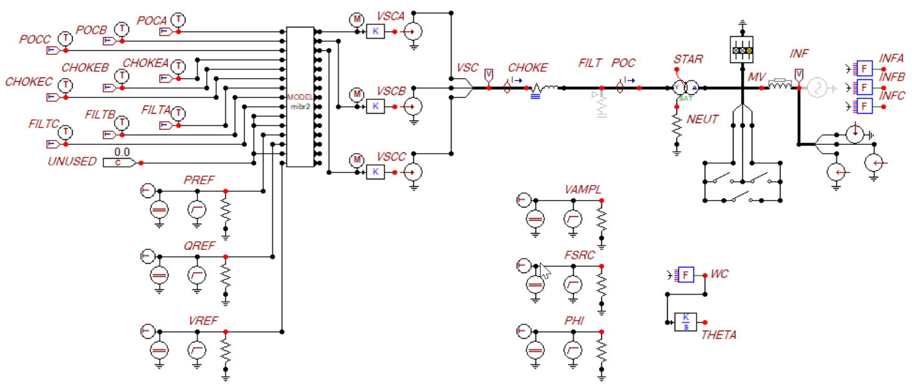

# EMT Simulation Output from GFM_GFL_IBR2 DLL

These data files come from ATP simulations of the GFM_GFL_IBR2 DLL. The ATP outputs
were converted to COMTRADE format and then to HDF5. The data may be useful in DLL
testing with other EMT simulators, and for development of automated model evaluation
scripts per IEEE 2800 and/or NERC MOD-026-2.

The files include:

1. _downsample.hdf5_, all ATP simulation outputs, downsampled from a 10-microsecond time step to a 100-microsecond time step, for 150 cases.
2. _prepped.hdf5_, downsampled traces of P, Q, f, V1, and V2 for model evaluation.
3. _plot_atp.py_, creates 150 PNG files from _base.hdf5_.
4. _MakeDocx.py_, assembles 150 PNG files into a Word document.
5. _gfm_gfl_ibr2_tests.docx_ contains 150 cases plotted, as in Appendix A of https://www.epri.com/research/products/3002028322.
6. _prep_atp.py_ creates _prepped.hdf5_ and _downsample.hdf5_ from _base.hdf5_. Due to GitHub size restrictions, _base.hdf5_ cannot be published here.
7. _process_atp.py_ plots one case from _prepped.hdf5_. Code to be developed will tabulate quantitative metrics for the case plotted.
8. _cases.json_ describes the parameter variations in 150 test cases.

## DLL Code Changes

Compared to the DLL code listing in EPRI's report, this one was changed as follows:

* Closed-loop Q control input was immediately switched off in fault ride through (FRT) mode. This matches a block diagram of EPRI's PSCAD model, and it helps to keep the closed-loop Q PI controller within useful operating bounds. This is the most significant change.
* The anti-windup integrators were changed from back calculation to clamping.
* The voltage reference was changed from a parameter to a signal, for interface with plant controllers and test signals.
* Parameters were added for power and control voltage filters, the series filter resistance, and the shunt filter. The shunt filter is not yet implemented.

## ATP Test Circuit

**ATP Test Circuit for 150 Simulations in Appendix A of the EPRI Report**

The DLL parameters were set at default values, except as varied in _cases.json_. The test
circuit parameters are:

* **Transformer** is wye/delta, 0.6/34.5 kV, 1 MVA, Z=0.6 + j6%, core loss = 0.25%, magnetizing current = 1%, neutral resistance = 1e6 Ohms.
* **Grid Impedance** j167.55 Ohms in parallel with 1667.6 Ohms.
* **Series Filter** 0.75 milliOhms in series with j0.0377 Ohms, i.e., 0.1 mH.
* **Shunt Filter** not implemented yet.
* **Faulting Switches** controlled by times TAC1 (close) and TAC2 (open) for phase A-C faults, etc. When active, faults occur from 4.0 to 4.2s of the simulation.
* **Average VSC Sources** controlled by modulation index outputs, multiplied by _Vdc_/2 = 600.
* **DLL Electrical Inputs** are voltages _POCA_, _POCB_, and _POCC_. Without the shunt filter, the VSC output and the POC currents are equal, _CHOKEA_, _CHOKEB_, _CHOKEC_, _FILTA_, _FILTB_, and _FILTC_.
* **DLL Reference Inputs** for _P_, _Q_, and _V_ are setup for a steady-state value, e.g., _PREF0_, plus an optional step at 4.0s, e.g., _DPREF_.
* **Grid Source** is a 34.5-kV balanced cosinusoid, configured for optional step changes in magnitude _VAMPL_, frequency _FSRC_, or angle _PHI_ at 4.0s.

To access the source ATP files, please message this site owner and self-certify that you
have an ATP license. Then your GitHub user ID will receive permission to access
https://github.com/temcdrm/emthubsupport

Copyright &copy; 2025-26, Meltran, Inc
