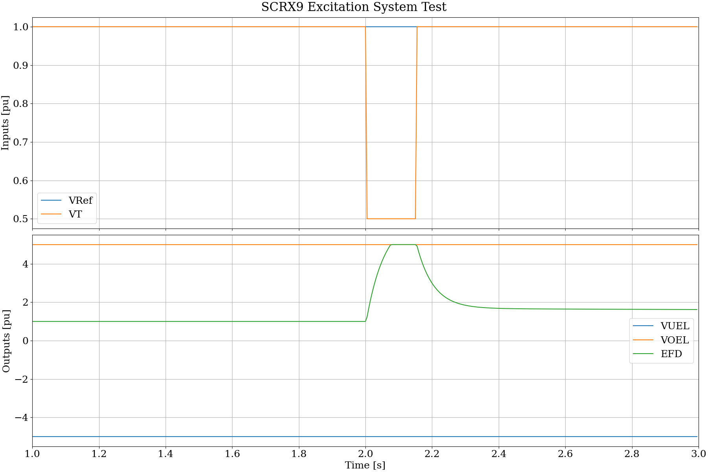
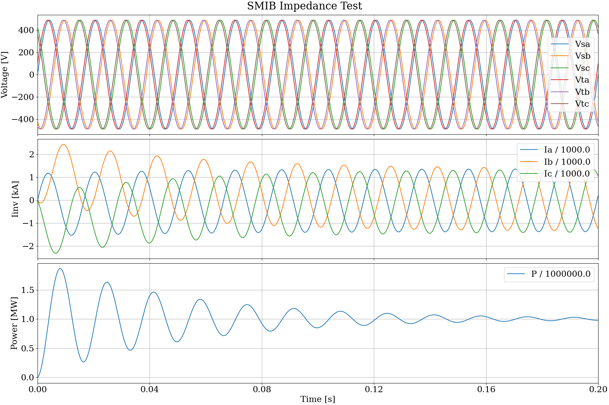
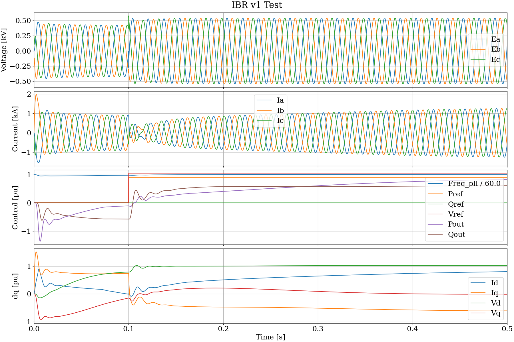
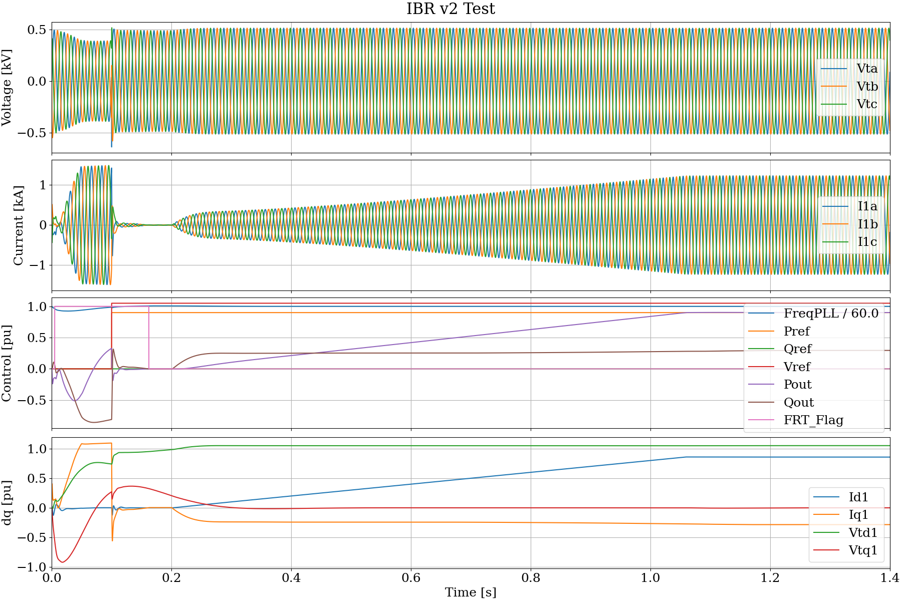
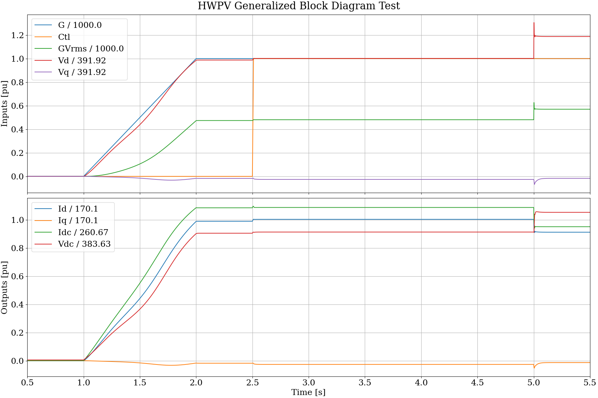
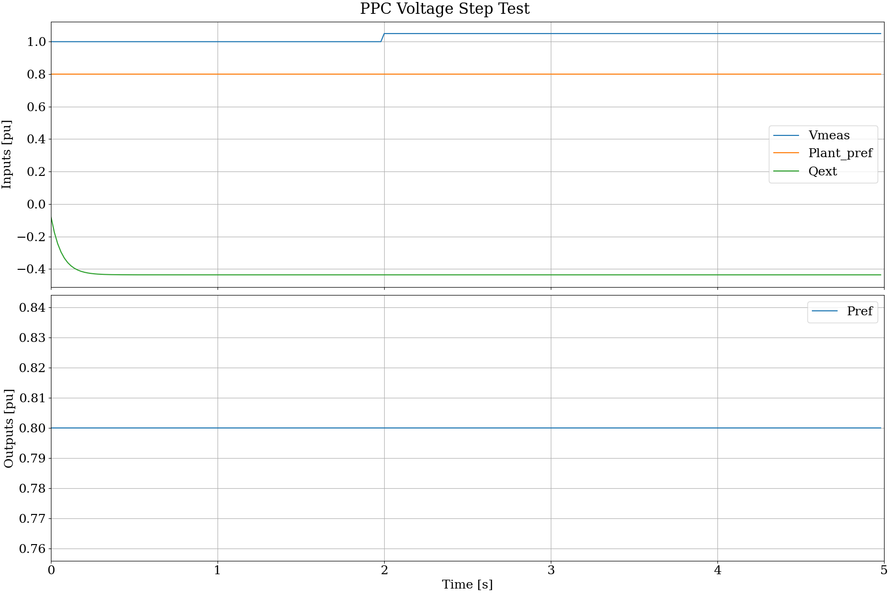
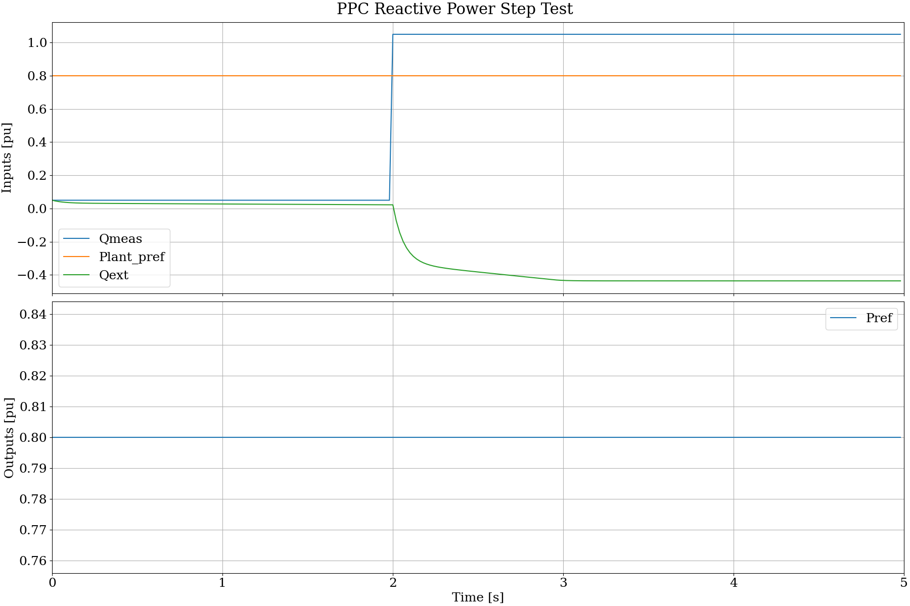
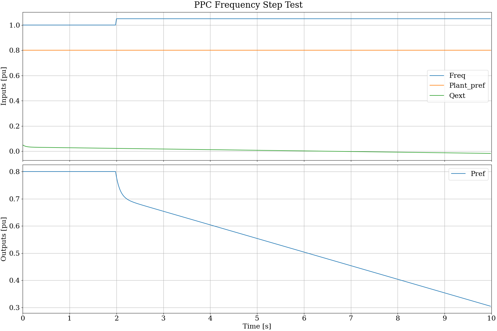

.. role:: math(raw)
   :format: html latex
..

.. _target-examples-dll:

DLL Examples
============

These projects build a supporting wrapper around the IEEE/Cigre specification
for dynamic link libraries (DLLs), and three examples. They should be built
in the following order.

1. First, install the compiler and Cmake from `Visual Studio <https://visualstudio.microsoft.com/downloads/>`_
   (find *Build Tools for Visual Studio 2022* under *Tools for Visual Studio 2022*). 
   Python is also used for plotting test results.
2. All DLL builds are performed in the *x64 Native Tools Command Prompt for VS 2022*, 
   which is on the Windows Start Menu.
3. Build the *wrapper* project, as the following **four** examples depend on it.
4. Build and test the *SCRX9* example, which is a self-contained static 
   exciter DLL from Electranix.
5. Build and test the *GFM_GFL_IBR* example, which is a self-contained inverter-based 
   resource (IBR) controller from EPRI.
6. Build and test the *GFM_GFL_IBR2* example, which is version 2 of a self-contained IBR controller from EPRI.
7. Build and test the *HWPV* example, which is a data-driven IBR model from PNNL and UCF. 
   This example is not self-contained; you will have to download and build a JSON support 
   library, and sample data-driven model files.
8. Build and test the *PPC* example, which is a renewable plant controlller model 
   (WECC REPCA) compiled with OpenModelica (a required download for this example).

The build instructions will produce 64-bit and 32-bit versions of all example DLLs, 
test harnesses, and support libraries. A 32-bit simulator, such as ATP, will need the 32-bit DLLs.

These five examples can be built and tested in Python. To run the DLL
examples in ATP, follow the `linking instructions <https://github.com/temcdrm/emthubsupport/tree/main/atp/dll>`_
after compiling and linking the DLLs. An ATP license is required for access to these linking instructions.

.. _target-examples-scrx9:

SCRX9
-----

This is an example DLL for the IEEE/Cigre specification, a static exciter model
for synchronous machines. Developed by Electranix.

Build Instructions - Windows
^^^^^^^^^^^^^^^^^^^^^^^^^^^^

Follow these instructions to make 64-bit and 32-bit versions of the DLL:

1. Open the *x64 Native Tools Command Prompt for VS 2022* from Windows Start Menu
2. From the *SCRX9* project directory (``rd /s build`` and ``rd /s build32`` if they exist):

    a. ``md build``
    b. ``md build32``
    c. ``cmake -B build -A x64``
    d. ``cmake -B build32 -A Win32``
    e. ``cmake --build build --config Release`` or ``cmake --build build --config Debug``
    f. ``cmake --install build``
    g. ``cmake --build build32 --config Release` or ``cmake --build build32 --config Debug``
    h. ``cmake --install build32``

3. From the *SCRX9/build* and *SCRX9/build32* directories, check the exported functions with no wrapper:

    a. ``dumpbin /exports release/SCRX9.dll`` or ``dumpbin /exports debug/SCRX9.dll``
    b. ``release/test`` generates an output CSV file in the *../../bin* directory
    c. From the *../bin* directory, relative to *SCRX9*, check outputs with ``python plotdlltest.py``

4. From the *../bin* and *../bin32* directories, check the **DLL wrapper**:

    a. ``test_scrx9`` should give the same results as ``release/test`` above
    b. Verify with ``python plotdlltest.py`` from the *../bin* and *../bin32* directories relative to *SCRX9*

File Directory
^^^^^^^^^^^^^^

- *CMakeLists.txt* generates the detailed build instructions
- *SCRX9.c* is the (nearly) unmodified example file from Garth Irwin of Electranix
- *test.c* is a test harness, mimicking the DLL import and calling functions of a simulation tool
- *test_scrx9.c* is a test harness, invoking the DLL through an EMTHub wrapper that supports all IEEE/Cigre DLLs

Results
^^^^^^^

The following result shows a drop in terminal voltage at 2.0 s to 0.5 pu. The *EFD*
output responds as limited by the overexcitation limiter value, *VOEL*.

.. _target-examples-grid:

Grid Impedance
--------------

This tests a single-machine, infinite-bus (SMIB) grid that an inverter model may be connected to.
The grid consists of a three-phase voltage source with three-phase source impedance.
Trapezoidal integration is used to solve for currents in the source impedance, given 
the voltages on each terminal of the impedance. One terminal voltage is defined by the
SMIB voltage source. The other terminal voltage is defined by the connected DLL's output.

In this example, the DLL's output voltage is mimiced in code. The purpose of this test
is to verify proper execution of the trapezoidal integration at each time step. The output should
show inductive currents all beginning at zero, then gradually assume the expected
sinusoidal shapes, 120 degrees apart, with no DC offset in the current. The DLL
controller action is not included. To do that, code from this example is incorporated into 
the *../gfm_gfl_ibr/test_ibr.c* and *../gfm_gfl_ibr2/test_ibr2.c* source files.

Build Instructions - Windows
^^^^^^^^^^^^^^^^^^^^^^^^^^^^

1. Open the *x64 Native Tools Command Prompt for VS 2022* from Windows Start Menu
2. From the *grid* project directory (``rd /s build`` if it exists):

    a. ``md build``
    b. ``cmake -B build -A x64``
    c. ``cmake --build build --config Release`` or ``cmake --build build --config Debug``
    d. ``cmake --install build``

3. From the *../bin* directory, check the trapezoidal integration output:

    a. ``test_grid`` should produce an output *grid.csv* file
    b. Verify with ``python plotdlltest.py grid.csv``

File Directory
^^^^^^^^^^^^^^

- *CMakeLists.txt* generates the detailed build instructions
- *test_grid.c* implements trapezoidal integration for current in a three-phase source impedance

Results
^^^^^^^

The following result shows the voltages at each terminal and the currents through
each phase of a 0.01 + j 0.20 per-unit grid impedance. The source voltage is 600 volts
line-to-line and the base power is 1 MW. The phase angle between terminal voltages is 11.54
degrees, to create approximately 1 per-unit or 1 MW power flow. The inductive currents
begin at zero, so there is a transient response as the DC offset decays and the power
flow approaches 1 MW.

.. _target-examples-gfm1:

GFM GFL v1
----------

This is an example DLL for the IEEE/Cigre specification, implementing grid-forming (GFL) 
and grid-following (GFL) behaviors for inverter-based resources (IBR). Developed by EPRI.

Build Instructions - Windows
^^^^^^^^^^^^^^^^^^^^^^^^^^^^

Follow these instructions to make 64-bit and 32-bit versions of the DLL:

1. Open the *x64 Native Tools Command Prompt for VS 2022* from Windows Start Menu
2. From the *GFM_GFL_IBR* project directory (``rd /s build`` and ``rd /s build32`` if they exist):

    a. ``md build``
    b. ``md build32``
    c. ``cmake -B build -A x64``
    d. ``cmake -B build32 -A Win32``
    e. ``cmake --build build --config Release`` or ``cmake --build build --config Debug``
    f. ``cmake --install build``
    g. ``cmake --build build32 --config Release` or ``cmake --build build32 --config Debug``
    h. ``cmake --install build32``

3. From the *../bin* and *../bin32* directories, check the **DLL wrapper**:

    a. ``test_ibr`` should produce an output *ibr.csv* file
    b. Verify with ``python plotdlltest.py ibr.csv``

File Directory
^^^^^^^^^^^^^^

- *CMakeLists.txt* generates the detailed build instructions
- *GFM_GFL_IBR.c* is the unmodified example file from Deepak Ramasubramanian of EPRI
- *test_ibr.c* is a test harness, mimicking the DLL import and calling functions of a simulation tool

Results
^^^^^^^

The base voltage is 0.65 kV and the base power is 1 MW. The SMIB impedance 
is 0.01 + j 0.2 pu. The AC output filter of the inverter is not 
implemented. At 0.1 s, the control requests 1.05 pu voltage and 0.9 pu 
power output. *Qref* is not changed but the reactive power output must be 
controlled to achieve the desired output value. The DLL controls the phase 
currents are controlled to nearly achieve these requests by 0.5 s, as seen 
in plotted values of *Pout*, *Qout*, and *Vd*. 

.. _target-examples-gfm2:

GFM GFL v2
----------

This is an example DLL for the IEEE/Cigre specification, implementing grid-forming (GFL) 
and grid-following (GFL) behaviors for inverter-based resources (IBR). 
See `EPRI Report <https://www.epri.com/research/products/3002028322>`_. This is a newer version of the
EPRI-developed IBR model presented in *../gfm_gfl_ibr*. 

Build Instructions - Windows
^^^^^^^^^^^^^^^^^^^^^^^^^^^^

Follow these instructions to make 64-bit and 32-bit versions of the DLL:

1. Open the *x64 Native Tools Command Prompt for VS 2022* from Windows Start Menu
2. From the *GFM_GFL_IBR2* project directory (``rd /s build`` and ``rd /s build32`` if they exist):

    a. ``md build``
    b. ``md build32``
    c. ``cmake -B build -A x64``
    d. ``cmake -B build32 -A Win32``
    e. ``cmake --build build --config Release`` or ``cmake --build build --config Debug``
    f. ``cmake --install build``
    g. ``cmake --build build32 --config Release` or ``cmake --build build32 --config Debug``
    h. ``cmake --install build32``

3. From the *../bin* and *../bin32* directories, check the **DLL wrapper**:

    a. ``test_ibr2`` should produce an output *ibr2.csv* file
    b. Verify with ``python plotdlltest.py ibr2.csv``

File Directory
^^^^^^^^^^^^^^

- *CMakeLists.txt* generates the detailed build instructions
- *gfm_gfl_ibr2.c* is the unmodified example file from Vishal Verma of EPRI, OCR-scanned from the report downloadable from https://www.epri.com/research/products/3002028322
- *test_ibr2.c* is a test harness, mimicking the DLL import and calling functions of a simulation tool

Results
^^^^^^^

The base voltage is 600 V and the base power is 1 MW. The SMIB impedance 
is 0.01 + j 0.2 pu. The AC output filter of the inverter is not 
implemented. The nominal DC voltages is 1200 V, half that value is 
multiplied by the DLL output modulation indices to create average source 
voltages. At 0.1 s, the control requests 1.05 pu voltage and 0.9 pu power 
output. However, the internal DLL control is not released until 0.2 s. 
*Qref* is not changed but the reactive power output must be controlled to 
achieve the desired output value. The DLL controls the phase currents are 
controlled to achieve these requests by 1.4 s, as seen in plotted values 
of *Pout*, *Qout*, and *Vtd1*. 

.. _target-examples-hwpv:

HWPV
----

This is an example DLL for the IEEE/Cigre specification, implementing generalized
block diagram models for solar photovoltaic inverters. See `pecblocks <https://pecblocks.readthedocs.io/en/latest/>`_ 
for more information.

Build Instructions - Windows
^^^^^^^^^^^^^^^^^^^^^^^^^^^^

Follow these instructions to make 64-bit and 32-bit versions of the DLL:

1. Open the *x64 Native Tools Command Prompt for VS 2022* from Windows Start Menu
2. Download and build the required `JSON support library <https://jansson.readthedocs.io/en/latest/>`_, 
   into a sibling directory of *EMTHub*.

    a. From the parent directory of *EMTHub*, 
       ``git clone https://github.com/akheron/jansson.git``
    b. ``cd jansson``
    c. ``md build``
    d. ``md build32``
    e. ``cmake -B build -A x64``
    f. ``cmake -B build32 -A Win32``
    g. ``cmake --build build --config Release``
    h. ``cmake --build build32 --config Release``
    i. ``copy build\lib\release\jansson.lib ..\emthub\dll\lib``
    j. ``copy build32\lib\release\jansson.lib ..\emthub\dll\lib32``

3. Clone the _pecblocks_ repository, into a sibling directory of _EMTHub_, for some example models:

    a. From the parent directory of *EMTHub*, ``git clone https://github.com/pnnl/pecblocks.git``
    b. The generalized block diagram models are located in various *json* files under the *examples* 
       directory. Some of these must be run at reduced power output, until new versions are trained 
       with sensitivity optimization, as described in `pecblocks documentation <https://pecblocks.readthedocs.io/en/latest/>`_

4. From this _hwpv_ project directory (``rd /s build`` and ``rd /s build32`` if they exist):

    a. ``md build``
    b. ``md build32``
    c. ``cmake -B build -A x64``
    d. ``cmake -B build32 -A Win32``
    e. ``cmake --build build --config Release`` or ``cmake --build build --config Debug``
    f. ``cmake --install build``
    g. ``cmake --build build32 --config Release`` or ``cmake --build build32 --config Debug``
    h. ``cmake --install build32``

5. From the *../bin* and *../bin32* directories, check the **DLL wrapper**:

    a. ``test_hwpv`` should produce an output *hwpv.csv* file
    b. Verify with ``python plotdlltest.py hwpv.csv``

File Directory
^^^^^^^^^^^^^^

- *CMakeLists.txt* generates the detailed build instructions
- *hwpv.c* implements forward evaluation of the trained generalized block diagram model
- *test_hwpv.c* is a test harness, mimicking the DLL import and calling functions of a simulation tool

Results
^^^^^^^

This result shows example response of the generalized block diagram model to ramp and step changes
in the inputs (solar irradiance, *G*, AC terminal voltage, *Vd* and *Vq*, a polynomial input feature,
*GVrms*, and an inverter mode transition flag, *Ctl*). The outputs *Id* and *Iq* drive a controlled
Norton equivalent current source on the AC side. The outputs *Idc* and *Vdc* are estimated quantities
for an external controller, i.e., they are not coupled to an electrical model on the DC side of the
converter in this example.

.. _target-examples-repca1:

WECC REPCA1
-----------

This directory contains an IEEE/CIGRE DLL wrapper around an FMU exported from OpenIPSL's 
`REPCA1` plant controller implementation [1]_. Other resources [2]_ and [3]_.

Limitations:

- Parameters are fixed at initialization
- Snapshots and states are unsupported

Prerequisites:

- Compiler and Cmake as described above
- OpenModelica (Tested with version 1.26.3)
- Python 3 (Tested with version 3.14.3)

.. [1] M. De Castro et al., “Version [OpenIPSL 2.0.0] - [iTesla Power Systems Library (iPSL): 
       A Modelica library for phasor time-domain simulations],” SoftwareX, vol. 21, p. 101277, 
       Feb. 2023, doi: 10.1016/j.softx.2022.101277.

.. [2] “Inverter-Based Resources Power Plant  Modeling and Validation Guideline.” 
       WECC. [Online]. Available: https://www.wecc.org/sites/default/files/documents/meeting/2026/IBR%20Power%20Plant%20Modeling%20and%20Validation%20Guideline.pdf

.. [3] “Model User Guide for Generic Renewable Energy Systems.” [Online]. 
       Available: https://www.epri.com/research/products/000000003002027129

Build Instructions - Windows
^^^^^^^^^^^^^^^^^^^^^^^^^^^^

Follow these instructions to make 64-bit and 32-bit versions of the DLL:

1. Open the *x64 Native Tools Command Prompt for VS 2022* from Windows Start Menu.
2. From the repository root:

    a. Checkout git submodule *OpenIPSL* from its git repository:
       ``git submodule update --init --recursive``
    b. Regenerate the FMU build files (default as-tested path to omc.exe is shown):
       ``python dll\ppc\fmu\generate_fmu_build.py --omc-cmd "c:\program files\openmodelica1.26.3-64bit\bin\omc.exe"``
    c. Remove *build* and *build32* if they already exist.
    d. ``md build``
    e. ``md build32``
    f. ``cmake -S dll\ppc -B build -A x64``
    g. ``cmake -S dll\ppc -B build32 -A Win32``
    h. ``cmake --build build --config Release`` or ``cmake --build build --config Debug``
    i. ``cmake --install build``
    j. ``cmake --build build32 --config Release`` or ``cmake --build build32 --config Debug``
    k. ``cmake --install build32``

3. From the *build* and *build32* directories, check the exported functions:

    a. ``dumpbin /exports Release\PPC.dll`` or ``dumpbin /exports Debug\PPC.dll``
    b. ``Release\TEST_PPC.exe`` generates CSV output for the wrapper-based harness
    c. ``python ..\dll\bin\plotdlltest.py ppc_voltage_step.csv`` plots one of the CSV output files

4. From the installed output directories:

    a. x64 installs to *dll\bin*
    b. Win32 installs to *dll\bin32*
    c. ``TEST_PPC.exe`` can also be run from those installed directories

The tests write CSV outputs for the configured scenarios.

File Directory
^^^^^^^^^^^^^^

- *fmu/PPC.mo*: wrapper model around `OpenIPSL.Electrical.Renewables.PSSE.PlantController.REPCA1`
- *fmu/export_fmu.mos*: OpenModelica FMU export script
- *fmu/generate_fmu_build.py*: regenerates `dll/ppc/CMakeLists.txt` after FMU export
- *PPC.c*: IEEE/CIGRE DLL wrapper around the exported FMU
- *test_ppc.c*: test harness using `DLLWrapper`

Results
^^^^^^^

The following result shows response of the plant controller to a step increase in terminal voltage.
There is no change in the plant active power reference, but the plant reactive power should decrease
(absorbing) to reduce the terminal voltage.

The following result shows response of the plant controller to a step reduction in the external
reactive power reference. There is no effect on the plant active power reference. There is no
response in measured reactive power because there is no power system connected to the controller.

The following result shows response of the plant controller to a step increase in the measured
frequency. There is no effect on the plant **requested** active power reference. However, the
controlled *Pref* should decrease in response to the frequency. There is no corresponding
response in system frequency becasue there is no power system connected to the controller.

Licenses
^^^^^^^^

**IEEE**: Contributions as per IEEE Open Source Apache 2.0 CLA for P3743 WG EMTIOP

**OpenIPSL**: license as per open-source license in repository source (https://github.com/OpenIPSL/OpenIPSL.git):

BSD 3-Clause License

Copyright (c) 2016-2026 Luigi Vanfretti, ALSETLab (formerly SmarTS Lab) and contributors.
All rights reserved.

Redistribution and use in source and binary forms, with or without
modification, are permitted provided that the following conditions are met:

* Redistributions of source code must retain the above copyright notice, this
  list of conditions and the following disclaimer.

* Redistributions in binary form must reproduce the above copyright notice,
  this list of conditions and the following disclaimer in the documentation
  and/or other materials provided with the distribution.

* Neither the name of the copyright holder nor the names of its
  contributors may be used to endorse or promote products derived from
  this software without specific prior written permission.

THIS SOFTWARE IS PROVIDED BY THE COPYRIGHT HOLDERS AND CONTRIBUTORS "AS IS"
AND ANY EXPRESS OR IMPLIED WARRANTIES, INCLUDING, BUT NOT LIMITED TO, THE
IMPLIED WARRANTIES OF MERCHANTABILITY AND FITNESS FOR A PARTICULAR PURPOSE ARE
DISCLAIMED. IN NO EVENT SHALL THE COPYRIGHT HOLDER OR CONTRIBUTORS BE LIABLE
FOR ANY DIRECT, INDIRECT, INCIDENTAL, SPECIAL, EXEMPLARY, OR CONSEQUENTIAL
DAMAGES (INCLUDING, BUT NOT LIMITED TO, PROCUREMENT OF SUBSTITUTE GOODS OR
SERVICES; LOSS OF USE, DATA, OR PROFITS; OR BUSINESS INTERRUPTION) HOWEVER
CAUSED AND ON ANY THEORY OF LIABILITY, WHETHER IN CONTRACT, STRICT LIABILITY,
OR TORT (INCLUDING NEGLIGENCE OR OTHERWISE) ARISING IN ANY WAY OUT OF THE USE
OF THIS SOFTWARE, EVEN IF ADVISED OF THE POSSIBILITY OF SUCH DAMAGE.

