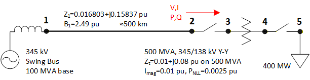
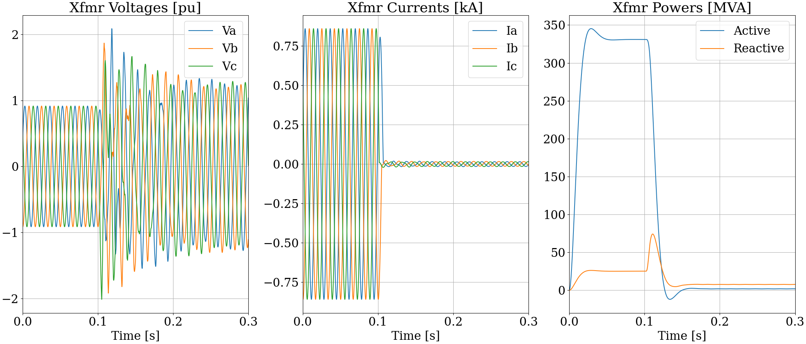
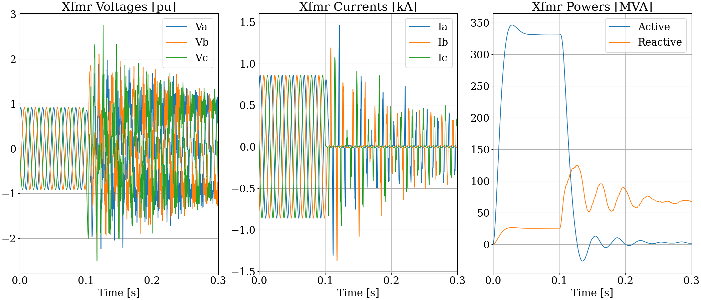
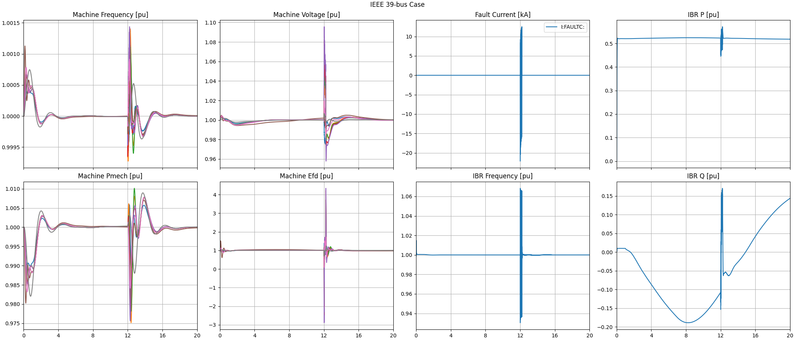
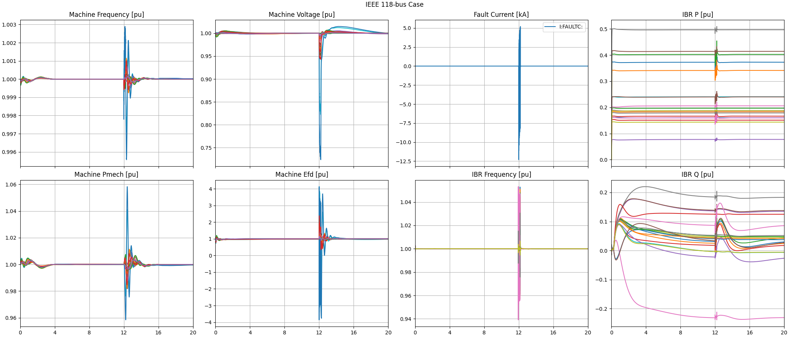
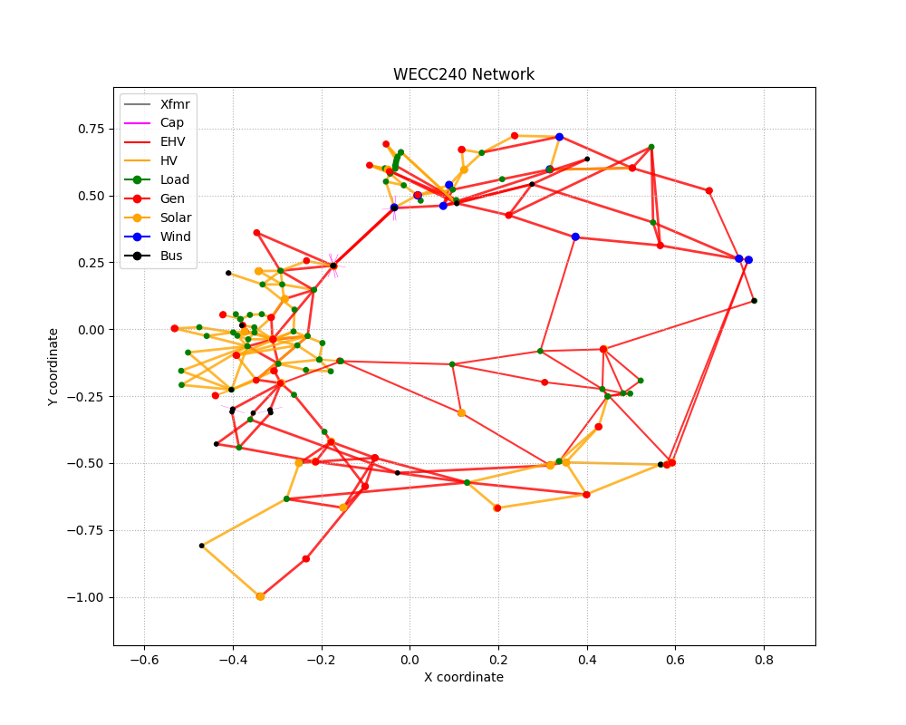
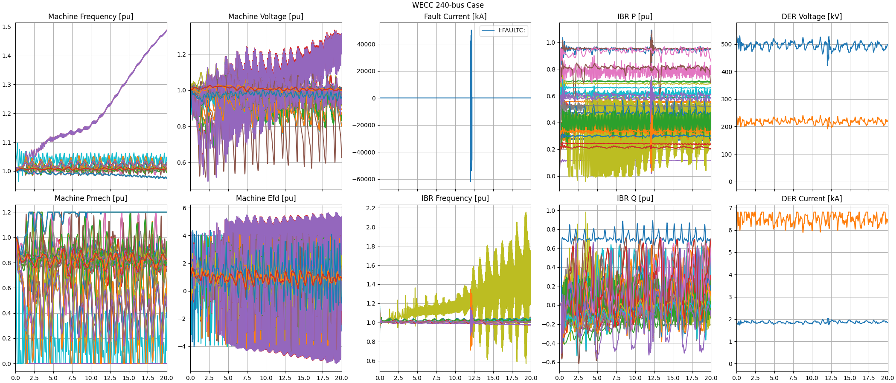
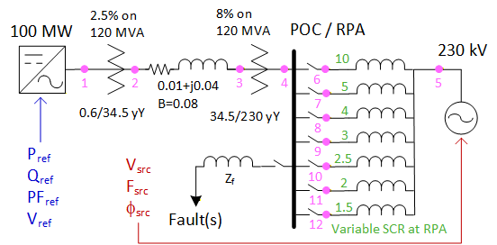
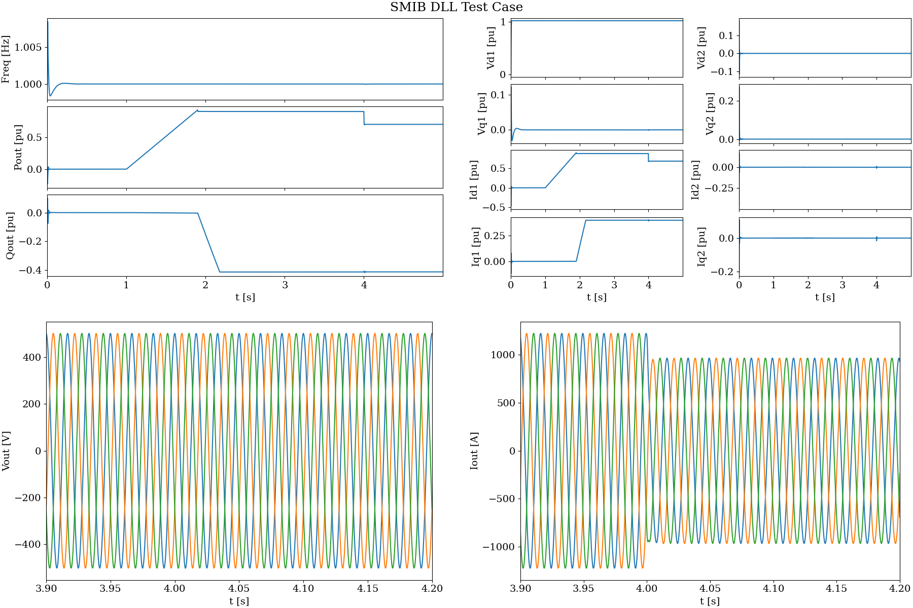

.. role:: math(raw)
   :format: html latex
..

.. _target-examples-network:

Network Examples
================

.. _target-examples-xfmrsat:

Transformer Saturation
----------------------

.. _target-examples-ieee39:

IEEE 39-Bus
-----------

.. image:: ../atp/data/IEEE39_network.png

.. _target-examples-ieee118:

IEEE 118-Bus
------------

.. image:: ../atp/data/IEEE118_network.png

.. _target-examples-wecc240:

WECC 240-Bus
------------

.. _target-examples-smibdll:

SMIB DLL
--------

