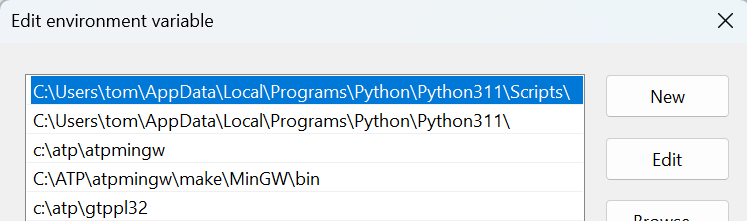

.. role:: math(raw)
   :format: html latex
..

Overview
========

EMTHub\ |reg| provides software and data schemas for standards-based model building and validation to perform electromagnetic transient (EMT) 
studies of electric utility power systems. The focus is on inverter-based resources (IBR), e.g., wind, solar, and storage, 
in electric utility systems. Network EMT models are based on an extension and profile of the Common Information Model (CIM), available
under the Apache 2.0 :ref:`target-license`. Unit and plant IBR models interface to a Cigre/IEEE specification on real-code modeling through dynamics link 
library (DLL) interfaces.

As part of IEEE P3743, Recommended Practice for Electromagnetic Transient Model Interoperability for Electric Power Transmission Systems, this
content will shortly move to an IEEE open-source project called `EMTIOP <https://opensource.ieee.org/emtiop>`_. The document under development by the P3743
Working Group is considered normative for the open-source software, and vice versa. For now, only members of the P3743 Working Group can access
draft versions of the document at `iMeet <https://ieee-sa.imeetcentral.com/p3743/>`_. Others may view the scope and purpose of P3743, and express
interest in joining its Working Group, at the `P3743 PAR Site <https://standards.ieee.org/ieee/3743/12233/>`_. In the meantime, until P3743 is
published, scripts and examples will run as documented here.

This content may also depend on `IEEE P3597 <https://standards.ieee.org/ieee/3597/12053/>`_, which aims to standardize the DLL interface. 
P3597 begins meeting in July 2026 at the IEEE PES General Meeting in Montreal.

The IEC CIM standards are not normative for P3743. The open-source software is based on the `CIM UML <https://cimug.org/cimdocs/standards-artifacts/>`_,
under an Apache 2.0 license.

.. _target-installation:

Installation - Windows
----------------------

Python 3.11.4 or greater is required. If necessary, install or update `Python <https://www.python.org/downloads/>`_. 
Then install the Python package from a Windows Command Prompt::

    pip install emthub

If you installed Python fresh from the Microsoft Store or the new Python 
install manager, it may not have added Python console scripts to the 
Windows path. You can do this in the Windows Settings app. If 
``emthub-list-cases`` fails to run in the next section, that means you 
need to complete this step. The path to add will be a subfolder of your 
Python installation, which should already be in the path. For example, the 
path you need to add might end with 
`\\Python\\pythoncore-3.14-64\\Scripts`. See the screenshot below for a 
**highlighted example** from an earlier version. It matches the core 
Python path directly underneath. It also shows some paths for optional ATP 
testing. 

MATPOWER
^^^^^^^^

`MATPOWER <https://matpower.org/>`_ is an open-source power flow (PF) 
solver used in most of the examples. It is a prerequisite that should be 
installed before proceeding further. If you have MATLAB, then MATPOWER can run 
as a MATLAB add-on. Otherwise, MATPOWER can run in the open-source `Octave <https://octave.org/>`_ package. 

Alternative Transients Program (ATP)
^^^^^^^^^^^^^^^^^^^^^^^^^^^^^^^^^^^^

`ATP <https://www.atp-emtp.org/>`_ is a free-to-use but not open-source 
EMT solver. It has restrictive license terms. Utilities, researchers, and 
some consultants are generally able to license ATP, but generally not EMT 
tool developers. The examples in this package run in ATP, so you may wish
to consider obtaining an ATP license and installing it. If not, you may still
create and examine ATP models from CIM using this package, which may be
helpful in developing other CIM-to-EMT model conversions. Therefore,
ATP is not a prerequisite for this package.

.. _target-quick-start:

Quick Start - Windows
---------------------

First, open a Windows Command Prompt and run an example. It is suggested that you create a directory
for testing, e.g., `emthub`, and then change to this directory. The command to list the available examples is::

    emthub-list-cases

which returns::

    Idx Name     mRID                                 Description
      0 IEEE39   6477751A-0472-4FD6-B3C3-3AD4945CBE56 39 buses, 9 machines, 1 IBR
      1 IEEE118  1783D2A8-1204-4781-A0B4-7A73A2FA6038 193 buses, 56 machines, 19 IBR
      2 WECC240  2540AF5C-4F83-4C0F-9577-DEE8CC73BBB3 333 buses, 105 machines, 35 IBR
      3 XfmrSat  93EA6BF1-A569-4190-9590-98A62780489E 5 buses, load rejection with transformer saturation
      4 SMIBDLL  62CB0930-211D-4762-B5C1-27BF73EAC7C4 12 buses in a test harness, 1 IBR in a DLL

To extract input files for the SMIBDLL example::

    emthub-extract-case 4

This copies about 20 files into your test directory, including some Python scripts and ATP support files.
Included are `gfm_gfl_ibr2.dll`, a 64-bit example DLL, and `gfm_gfl_ibr2.dll32`, the same model in
a 32-bit DLL. On a 64-bit Python installation, the 64-bit DLL is necessary to **configure** the `SMIBDLL` example::

    python create_smib_dll.py 4

This produces CIM RDF in `SMIBDLL.ttl` from hard-coded rawfile information, plus calling the DLL API locally. 
It also produces the same CIM RDF in `SMIBDLL.xml` and `SMIBDLL.json`. Examine any of these three files to
explore the CIM RDF.

To create an ATP netlist::

    python cim_to_atp.py 4

This creates an ATP network model in `SMIBDLL_net.atp` and part of the DLL interface in `DLL1.mod`. Even if you
don't have ATP installed, it may be profitable to explore the content of these files.

Optional - DLLs in ATP
----------------------

To **run** `SMIBDLL` in ATP, which is a 32-bit solver, you should copy `gfm_gfl_ibr2.dll32` into an ATP bin directory.
See `ATP DLL Readme <https://github.com/temcdrm/emthub/tree/main/atp/dll>`_ for more information. This involves linking
the DLL call as described `here <https://github.com/temcdrm/emthubsupport/tree/main/atp/dll>`_. If these steps have
been done, then the examples can be run in ATP. To run `SMIBDLL`::

    python atp.py 4 run

To convert the output from PL4 to COMTRADE and then HDF5::

    python atp.py 4 convert

To then plot the results::

    python atp.py 4 plot

Next Steps
----------

Next, choose one of the roadmaps to follow:

- :ref:`target-roadmap-users` to just run all the examples.
- :ref:`target-roadmap-profile` for maintaining the CIM extensions and profile.
- :ref:`target-roadmap-network` for developing and testing CIM data import to EMT tools.
- :ref:`target-roadmap-dynamics` for adding or maintaining more standardized controller models that are read from text files.
- :ref:`target-roadmap-dll` for developing and testing DLL models.

Consult the :ref:`target-bibliography` as needed for background information. 

Linux and Mac OS
----------------

The functions generally work as they do on Windows, except:

- Use ``python3`` and ``pip3`` instead of ``python`` and ``pip``, respectively.
- The DLLs don't work on Linux or Mac OS. If you want the appropriate `so` or `dylib` versions, please post an issue on GitHub and we will consider it.
- The execution of ATP is not supported. You can still generate ATP netlists.

A sample script file to run the test cases is::

    #!/bin/bash
    for i in {0..3}
    do
        emthub-extract-case $i
        python3 raw_to_rdf.py $i
        python3 bps_make_mpow.py $i
        python3 mpow.py $i
        python3 ic_to_rdf.py $i
        python3 cim_to_atp.py $i
    done
    emthub-extract-case 4
    # the next two steps produce incorrect results because the example DLL cannot be invoked on Linux or Mac OS
    python3 create_smib_dll.py 4
    python3 cim_to_atp.py 4
    python3 cim_summary.py

The last command summarizes CIM class counts in each example.

.. _target-repository:

Repository
----------

See `EMTHub directory <https://github.com/temcdrm/emthub>`_

To make a local copy, first `Install Git <https://github.com/git-guides/install-git>`_. Then 
invoke this command from a directory where source code will be kept, such as `c:\src`::

    git clone https://github.com/temcdrm/emthub.git

.. |reg|    unicode:: U+000AE .. REGISTERED SIGN
.. |copy|   unicode:: U+000A9 .. COPYRIGHT SIGN
.. |trade|  unicode:: U+2122 .. TRADEMARK

