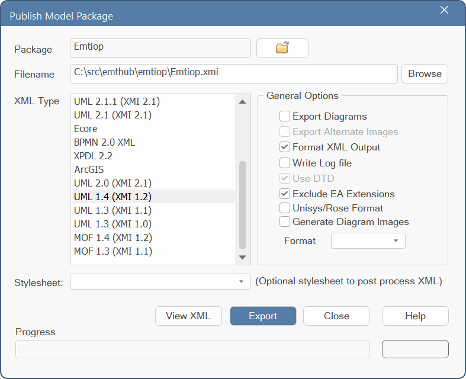
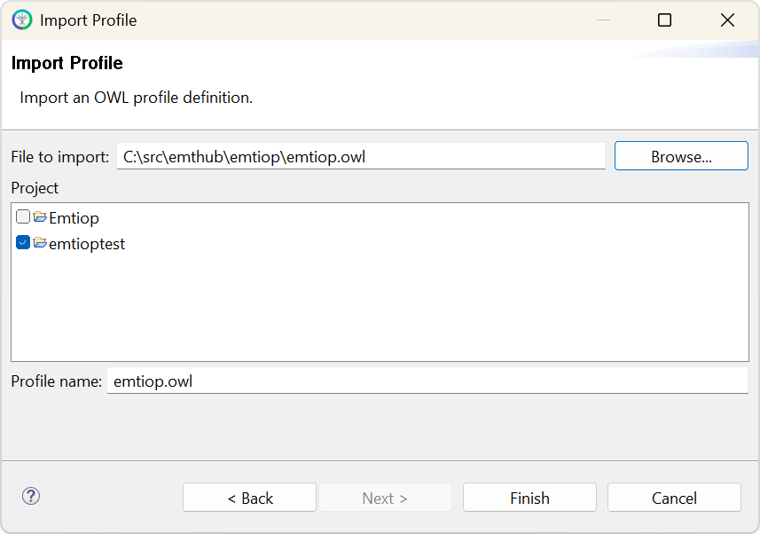
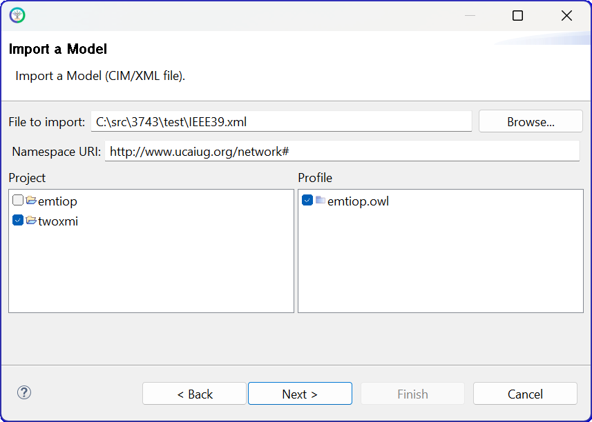

.. role:: math(raw)
   :format: html latex
..

Roadmaps
========

These subsections provide a suggested order of activities for different
kinds of stakeholders approaching EMT model interoperability.

.. _target-roadmap-users:

Users
-----

This roadmap applies to stakeholders that primarily run EMT simulations. It's also a good starting point for developers to become familiar
with content of the open-source software.

#. :ref:`target-installation` of the Python code and testing from the :ref:`target-quick-start` are prerequisites.
#. Consider whether to download `MATPOWER <https://matpower.org/>`_ for the power flow examples. This is open-source software that runs in open-source `Octave <https://octave.org/>`_, or in MATLAB.
#. Consider whether to download `ATP <https://www.atp-emtp.org/>`_ for the EMT examples. This is free-to-use, but has restrictive license terms. Utilities, researchers, and some consultants are generally able to license ATP, but generally not EMT tool developers.

   a. Contributors are invited to provide examples that run in other EMT simulators.

#. Run the five cases in :ref:`target-examples-network` using the following scripts.

This batch file extracts all five examples to CIM RDF, with ATP and MATPOWER netlisting. It also solves four examples in MATPOWER::

    @echo off
    for /L %%i in (0,1,3) do (
        emthub-extract-case %%i
        python raw_to_rdf.py %%i
        python bps_make_mpow.py %%i
        python mpow.py %%i
        python ic_to_rdf.py %%i
        python cim_to_atp.py %%i
        )
    emthub-extract-case 4
    python create_smib_dll.py 4
    python cim_to_atp.py 4
    python cim_summary.py

The last command summarizes CIM class counts in each example.

This batch file runs all five examples in ATP. In this version, plots are saved in `png` format so the batch file continues uninterrupted::

    @echo off
    for /L %%i in (0,1,4) do (
        python atp.py %%i "run"
        python atp.py %%i "convert"
        python atp.py %%i "png"
        )

With a MATPOWER installation, you should obtain summary power flow output with bus voltages usually in the range 0.95 to 1.05 per-unit.
However, the *XfmrSat* example has low initial voltage at the load end of the line. The *WECC240* case has a few dozen overloaded branches.
The *SMIBDLL* example initializes from zero, so MATPOWER is not used with it.

With an ATP installation, you should be able to match the outputs in :ref:`target-examples-network`.

.. _target-roadmap-profile:

Profile Maintainers
-------------------

This roadmap applies to stakeholders that primarily manage CIM UML and profiles. They do not necessarily run EMT simulations.

#. :ref:`target-roadmap-users` Roadmap is a pre-requisite.
#. The CIM UML, which includes version *18v15* of the *Grid* package, should be obtained from the `CIM Users Group <https://cimug.org/cimdocs/standards-artifacts/>`_. Look for *Draft CIM Model Releases* and then a 48-MB zip file that includes *Grid18v15* in the file name. Download that to your hard drive and unzip it.
#. A UML editing tool is suggested for exploring and extending the CIM UML. Chapter 10 of the `CIM Modeling Guide <https://cimug.org/cimdocs/model-manager-documents/>`_ provides advice on this topic.
#. To create and update profiles, document profiles, produce SQL data definition scripts, and check CIM RDF instance files against a profile, you need the open-source `CIMTool <https://cimtool.ucaiug.io/>`_.

These files, tools, and on-line documents provide the initial knowledge 
base to perform segments of the workflow shown below. In the upper left, 
the file *CIM_Grid_18v15.xmi* [1]_ has been reduced in size, by deleting the 
unnecesary (for EMT) *Enterprise* and *Market* packages. For *CIMTool*, it 
was also necessary to delete profile packages distributed within the base 
CIM file by the CIM Users Group. The three shaded files are key items 
maintained on the open-source software site for P3743: 
 
#. *Emtiop.xmi* contains the CIM extensions for EMT, output from  the UML editor and input to *CIMTool*. This file is relatively small and kept under version control. It should be possible to use this extension file with future versions of the base CIM. The format is a variant of *xml*.
#. *emtiop.owl* is the profile for EMT. This is created by selecting classes and attributes from the base CIM with extensions in *CIMTool*. You should check example CIM RDF instance files, some of them listed at the lower left, against the profile and resolve any errors.
#. *emtiop.html* documents the classes and attributes used in the profile for EMT. It is built automatically from *CIMTool* and included in this on-line documentation as part of :ref:`target-cim-profile`. 

.. image:: assets/ProfileFlow.png

For use with SQL implementations, *CIMTool* also produces *emtiop.sql* to 
define SQL tables. This doesn't work for Python's *sqlite3* package; 
manual editing is necessary to add foreign keys at the same time as tables 
are created. This is not necessary if using CIM RDF implementations.
 
*CIMTool* stores its files in a "workspace" under its local installation. 
Any files imported into *CIMTool* will be copied into this workspace. Once 
the files are copied, it's recommended to let *CIMTool* manage the 
workspace files itself. *CIMTool* began as an Eclipse plugin, and has 
since been more conveniently packaged as a standalone installation. The 
following steps illustrate a successful sequence of importing the schema, 
importing the profile from version control, and checking one of the 
example instance files against the profile. 

#. Extract the :ref:`target-repository` if you haven't already.
#. Start *CIMTool*. Version *2.3.0 RC4* was used in this demonstration.
#. Use the *File/New/CIMTool Project* menu command.
#. On the page **New CIMTool Project**, name the project *emtioptest*. It will typically create the workspace in *C:\\CIMTool-2.3.0-RC4\\workspace\\emtioptest*. Click *Next >*.
#. On the page **Project Copyright Templates Configuration**, select the option *Do not include copyrights* and click *Next >*.
#. On the page **Import Initial Schema**:

   - Browse to the *CIM_Grid_18v15.xmi* file containing the base CIM schema, which includes the *Grid18v15* package.
   - Specify the *Namespace URI* as *http://www.ucauig.org/ns#* (check the *Preference* option if necessary).
   - Leave the *During import merge shadow class extensions* and *Enable self-healing* options checked (these may be grayed out). 
   - Turn off the *CIMTool Schema Model Validation Report*. 
   - The page should look similar to the screen shot below. Click *Finish*.

.. image:: assets/CIMTool1.png

7. The *Project Explorer* should show the imported CIM base schema, as shown below.

.. image:: assets/CIMTool2.png

8. Use either the archived CIM extensions in *Emtiop.xmi*, or export your own *Emtiop.xmi* from the UML editing tool (*EA* or an alternative). 
   This same procedure was used to create the base *CIM_Grid_18v15.xmi* file.

   - In *EA*, select the <<CIMExtension>> Emtiop* pacakge in the *Browser*, *Project* tab on the left-hand side of the application.
   - Invoke the *Export / Other Formats* menu command from the *Publish* tab in the ribbon.
   - Select the *UML 1.4 (XMI 1.2)* export type.
   - Select **only** the *Format XML Output* and *Exclude EA Extensions* options. Your dialog should be similar to that shown below. 
     Verify that the *Package* at the top is *Emtiop*. Verify that *Filename* shows your desired output file.
   - Click *Export* and then you may exit *EA*

9. The next step is to add the CIM extension *xmi* file to the base CIM *xmi* file in *CIMTool*.
10. Right-click on the *Schema* item under the *emtioptest* workspace in *Project Explorer*. Click *Import* on the pop-up menu and then select *Import Schema*, as shown below.

.. image:: assets/CIMTool3.png

11. Click *Next* to bring up the **Import Schema** page, similar to item 6. Leave the options as before, but browse to *Emtiop.xmi* 
    in your local copy of the GitHub repository. The page should be similar to the screen shot below. Then click *Finish*.

.. image:: assets/CIMTool4.png

12. The *Project Explorer* and *Project Browser* should reflect the content of both *xmi* files, as shown below.

.. image:: assets/CIMTool5.png

13. Right-click on the *Profiles* item under the *emtioptest* workspace in *Project Explorer*. Click *Import* on the pop-up menu 
    and then select *Import Profile*. Click *Next*. This brings up the **Import Profile** page. Click *Browse* and navigate to the 
    archived *emtiop.owl* file as shown below. Then click *Finish*.

14. This imports and verifies the profile against the loaded schema of base CIM with extensions. Correct any errors
    reported. These are generally caused by mismatches in different versions of the profile and CIM extension, which
    may require some iterations to resolve. The profile import should produce no errors before taking the next step.

15. Right-click on the *Instances* item under the *emtioptest* workspace in *Project Explorer*. Click *Import* on 
    the pop-up menu and then select *Import Model (CIM/XML file)*. Then click *Next*. This brings up the **Import a Model** page.
    Click *Browse* and navigate to one of the example CIM RDF files, in *xml* format, as shown below. [2]_ The *Namespace URI* should be
    left as shown. The correct check boxes for *Project* and *Profile* should be selected. Then click *Next*. 

16. The **Model Details** page should have a proper *Model file name* filled in. If you are re-importing the same model in
    the process of fixing errors, select the check box to *Replace existing model*. For a first-time import of that model,
    the check box should be disabled. Click *Finish*.

17. This imports and verifies the network model against the profile, including CIM extensions. Any errors should be
    resolved before testing other network models, and before deploying any code. This may require iterations in the
    CIM extensions, the profile, and/or the code used to create the network model *xml* files from *raw* and *dyr* files.

From this point, please consult the *CIMTool* documentation and the *CIM Modeling Guide*
for advice on how to proceed.

.. [1] Instead of importing two separate *xmi* files to *CIMTool*, it is 
   also possible to import one *CIM_Grid_18v15_Emtiop.qea* file. This 
   combined *qea* file is not under version control; a developer would have 
   to merge the two separate *xmi* files into a single *qea* file using the 
   commercial UML editor. This approach can be more efficient in working on 
   CIM extensions and profiles in a single workflow. At significant 
   milestones, be sure to export *Emtiop.xmi* from the UML editor for version 
   control. We keep two *xmi* files under version control because only the 
   smaller *Emtiop.xmi* is expected to change frequently.
   
.. [2] The example *xml* files were generated in the directory shown by
   completing the :ref:`target-roadmap-users` Roadmap in that directory. 

.. _target-roadmap-network:

Network Model Developers
------------------------

This roadmap applies to stakeholders that primarily import CIM network models to an EMT simulator's native format, i.e., EMT software developers.

#. :ref:`target-roadmap-users` Roadmap is a pre-requisite.
#. Examine the *create_atp.py* file that creates ATP netlists. This can be a starting point for implementing other CIM importers for EMT, even without having an ATP license.

   a. This script creates a file ending in *_net.atp*. That file syntax should be readable to developers familiar with EMT, even without ATP documentation. For more help, try this `book <https://doi.org/10.1002/9781119480549>`_. It has examples with segments of ATP input text.
   b. The script may be found in the GitHub repository: `create_atp.py <https://github.com/temcdrm/emthub/blob/main/src/emthub/create_atp.py>`_.
   c. The script may also be found in your local *emthub* package installation. From a Windows Command Prompt, type ``pip show emthub``. That will return a **Location** of your local *emthub* installation. Then you may find the ATP netlisting script at *Location\\emthub\\create_atp.py*. Using this method, you can examine other script and data files from your local *emthub* installation.

#. Become generally familiar with the :ref:`target-cim-profile`. This is a reference, not meant to read from beginning to end.
#. Become generally familiar with the :ref:`target-queries`. This is also a reference, not meant to read from beginning to end.
#. Develop and test the CIM-to-EMT conversion script for your own EMT simulator.

   a. Try testing the *XfmrSat* example first. It is the smallest example and has no generator dynamics.
   b. Try testing the *IEEE39* example next. It includes one IBR plant and some other machine dynamics..
   c. Try testing the *SMIBDLL* example next.  This adds the essential DLL interface to the baseline features already tested.
   d. Try testing *IEEE118* and then *WECC240*. These are similar to but larger than *IEEE39* and they add a few more types of network model components.

.. image:: assets/FileFlow.png

.. _target-roadmap-dynamics:

Dynamics Model Maintainers
--------------------------

This roadmap applies to stakeholders that add or update entries to be supported in 
`NthAmDynamicModel <profile.html#NthAmDynamicModel>`_. This may include power system phasor domain 
transient (PSPDT) developers, EMT developers, or others familiar with the underlying PSPDT text file formats.

#. :ref:`target-roadmap-users` Roadmap is a pre-requisite.
#. Access to at least one EMT simulation tool is a pre-requisite.
#. Examine the format of *detailed_model_types.json* in the :ref:`target-repository` *src/emthub/queries* subdirectory. This will be referred 
   to as the **configuration file**.
#. Find the applicable section in the **configuration file** that you wish to modify. The current choices are *AUX*, *DGS*, *DYD*, *DYR*, and *Other*. 
   The last choice is really intended for user code models in local settings. New choices can be added by :ref:`target-roadmap-profile` as needed.
#. To correct an existing **configuration file** entry, you should first edit the file and test the changes locally.

.. warning::
    Do not change any existing *mRID* values found in the **configuration file**. These are shared globally by all users of this package. Changes to the *mRID* could break existing models for all those users.

6. To test these relatively simple changes, you should have a PSPDT text file that references the changed dynamics model type.
   Follow a typical users process of importing the text files to CIM RDF, exporting for EMT simulation, running the
   EMT model in at least one tool, and verifying the EMT outputs are correct.
#. Also verify the documentation will update correctly, by invoking *make html* in the repository *docs* subdirectory.
#. After a good local test, commit your changes to the repository via a pull request. After the pull request has been approved and
   merged, the next release will include your changes.

To add brand new models to the **configuration file**, some additional steps are needed. The overall framework of local testing and
pull request still applies, but each new entry for the **configuration file** should consider the following:

#. Find the correct section in the file. See `NthAmModelNameKind <profile.html#NthAmModelNameKind>`_ for valid choices.
#. Add a model entry with *name* that matches the PSPDT file format's "model type" keyword.
#. Create a random UUID4 to become the new *mRID* for this new entry. Many tools and scripting library functions are able to create a random UUID4. Once created and saved in the **configuration file**, this *mRID* should never change. 
   It should be maintained in the package to guarantee persistence.
#. Add a *description*.
#. Review the standard controller models in CIM dynamics, and identify the *closestStandardModel*. There may not be an exact match, but if there is a relatively close match, that should be provided as a starting
   point for a future migration from PSPDT text file models to the standard CIM models. Chances are, the developer adding this model to **configuation file** is best positioned to identify the closest match.
#. Specify *nameKind* to match the file section. See `NthAmModelNameKind <profile.html#NthAmModelNameKind>`_ for valid choices.
#. Specify the *modelKind* for the expected application.  See `NthAmModelKind <profile.html#NthAmModelKind>`_ for valid choices.
#. Specify the *statusKind* for allowability in North American interconnection studies.  See `NthAmModelStatusKind <profile.html#NthAmModelStatusKind>`_ for valid choices.
#. Provide an array of *parameterDescriptors*, one for each value found in a "row" or "line" for this model in the PDPDT text file. Each descriptor should have:

    a. *name*, which should match the name given in PSPDT documentation.
    #. *mRID*, to be generated randomly and then **maintained under version control for global persistence**.
    #. *typicalValue*, if available. This may help in specifying the default value in a future migration to *closestStandardModel*.
    #. *engineeringUnit*, if available. This may help in specifying the correct CIM data type in a future migration to *closestStandardModel*.
    #. *sequenceNumber*, starting with 1, which should match the order expected in the PSPDT text file.

For illustration, a reduced-size version of the original **configuration file** follows.::

    {
      "AUX": {
      },
      "DGS": {
      },
      "DYD": {
      },
      "DYR": {
        "SEXS": {
	  "mRID": "854A4288-2FB4-47F9-A194-395CF22DD4E8",
	  "description": "Legacy static exciter",
	  "closestStandardModel": "ExcSEXS",
	  "nameKind": "DYR",
	  "modelKind": "excitationSystem",
	  "statusKind": "prohibited",
	  "parameterDescriptors": [
	    {
	      "name": "Bus",
	      "mRID": "5FEC78BC-65D5-49CE-9D30-EA7F3D225EEF",
	      "typicalValue": "",
	      "engineeringUnit": "Integer",
	      "sequenceNumber": 1
	    },
	    {
	      "name": "Model",
	      "mRID": "8C11F175-B4E3-49A7-91C5-7396992785F8",
	      "typicalValue": "",
	      "engineeringUnit": "String",
	      "sequenceNumber": 2
	    },
	    {
	      "name": "ID",
	      "mRID": "A55C670D-7976-40C8-8A33-5A332070D53E",
	      "typicalValue": "1",
	      "engineeringUnit": "String",
	      "sequenceNumber": 3
	    },
	    {
	      "name": "TATB",
	      "mRID": "360A2A9E-48B2-49FA-83F5-5518A4E16F81",
	      "typicalValue": 0.1,
	      "engineeringUnit": "Float",
	      "sequenceNumber": 4
	    },
	    {
	      "name": "TB",
	      "mRID": "1FAE8B08-8F08-4773-AD98-AB0360E820EF",
	      "typicalValue": 10.0,
	      "engineeringUnit": "Seconds",
	      "sequenceNumber": 5
	    },
	    {
	      "name": "K",
	      "mRID": "1D4EF184-08B1-4633-BA51-0C3A121FDF94",
	      "typicalValue": 100.0,
	      "engineeringUnit": "PU",
	      "sequenceNumber": 6
	    },
	    {
	      "name": "TE",
	      "mRID": "0FAB61D9-EF26-4BCB-94FE-A19CBE2F3945",
	      "typicalValue": 0.05,
	      "engineeringUnit": "Seconds",
	      "sequenceNumber": 7
	    },
	    {
	      "name": "EMIN",
	      "mRID": "8C71701D-5C80-4E16-A5DB-9356BCB91854",
	      "typicalValue": -5.0,
	      "engineeringUnit": "PU",
	      "sequenceNumber": 8
	    },
	    {
	      "name": "EMAX",
	      "mRID": "87E5FD37-97F8-4DE7-B23E-C3EA78AFF8FF",
	      "typicalValue": 5.0,
	      "engineeringUnit": "PU",
	      "sequenceNumber": 9
	    }
	  ]
        }
      }
    }

.. _target-roadmap-dll:

DLL Developers
--------------

This roadmap applies to stakeholders that primarily build DLL models of IBR and other controllers. This includes IBR hardware vendors, their consultants,
researchers, and EMT software developers who are building test cases.

#. :ref:`target-roadmap-users` Roadmap is a pre-requisite.
#. Run all six :ref:`target-examples-dll`.
#. The examples in this repository and the DLL interface specification all contemplate using the C language and Windows tools for developing DLLs.
   However, any language that can produce a DLL may be used, including but not limited to Fortran and Pascal. Furthermore, a "DLL" may be produced
   for other operating systems, under a name like "dylib" or "so", for EMT simulators that might run on those other operating systems. It should
   be possible to localize the different build environments for a DLL through a cross-platform *CMakeLists.txt* file, and by including system-dependent
   header files at the top of the DLL source file.
#. One example in this repository uses *Modelica* to generate C code, which is then compiled and linked to produce the DLL. There are other
   software tools available that have C-code generators. This allows a developer to produce the DLL without writing C code from scratch. When
   the reference controller model has already been implemented in another software tool that has code generation, this path is likely to
   save time and improve the model fidelity.
#. DLL developers should consider participating in `IEEE P3597 <https://standards.ieee.org/ieee/3597/12053/>`_, or at least observing its activity.
#. The DLL should be tested in at least one EMT simulator before publicly releasing the DLL. A few examples in this repository connect the
   DLL to a simple grid equivalent source, but that's not sufficient for testing. Those examples also use an EMT solver for testing the DLL.
