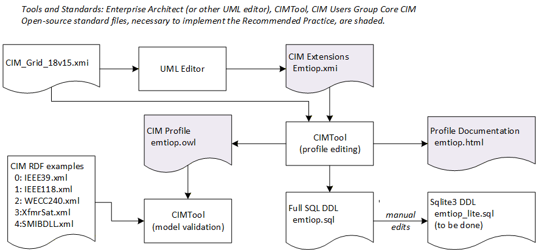
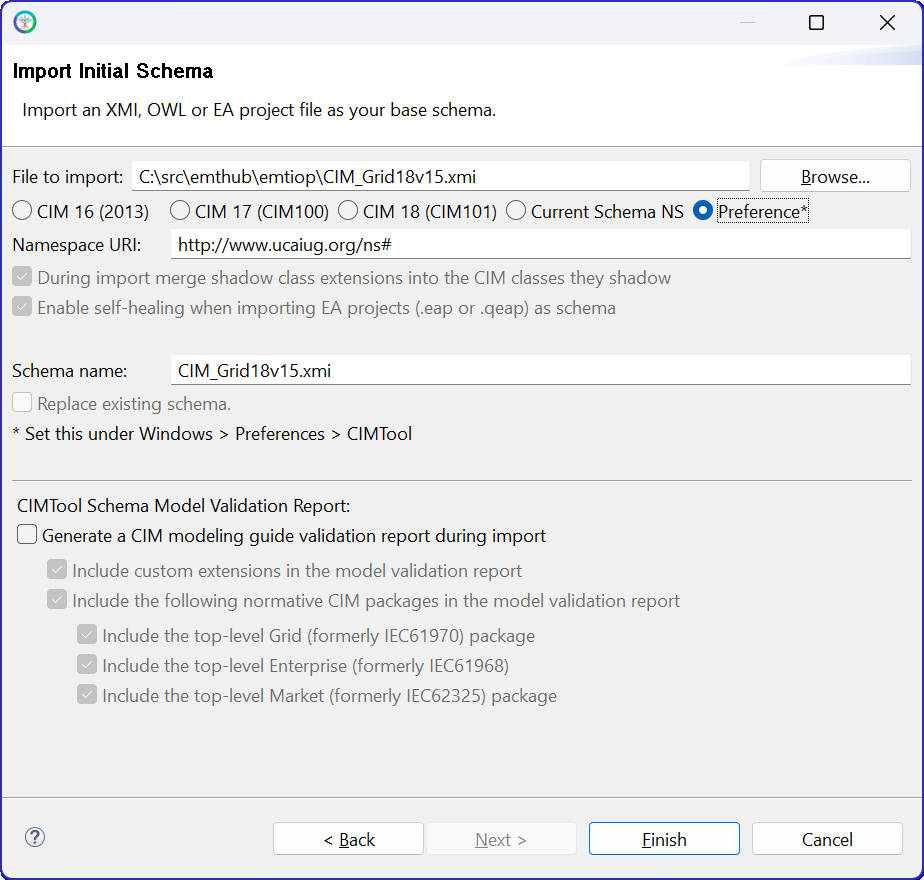
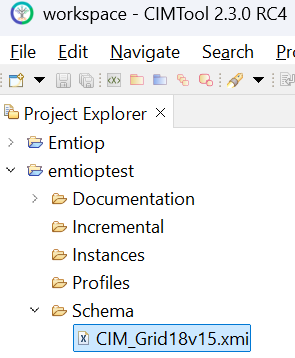
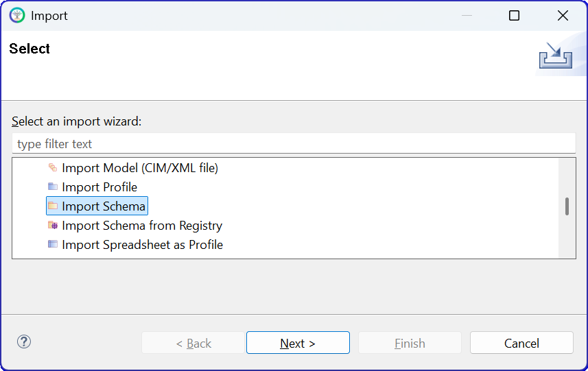
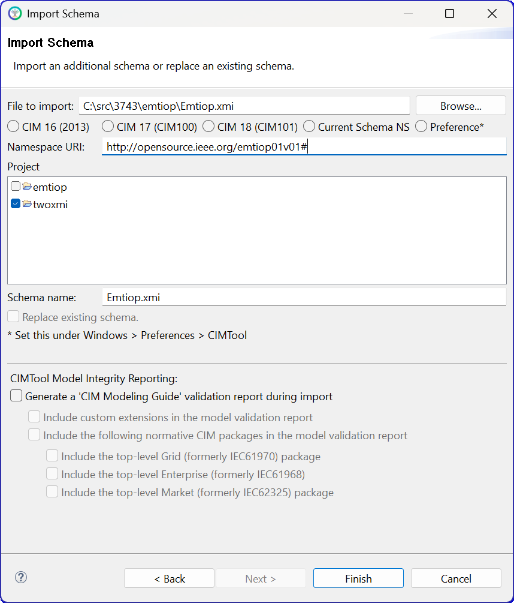
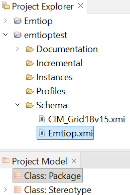

.. role:: math(raw)
   :format: html latex
..

Roadmap
=======

These subsections provide a suggested order of activities for different
kinds of stakeholders approaching EMT model interoperability.

.. _target-roadmap-users:

Users
-----

This roadmap applies to stakeholders that primarily run EMT simulations. It's also a good starting point for developers to become familiar
with content of the open-source software.

#. :ref:`target-installation` of the Python code and testing from the :ref:`target-quick-start` are prerequisites.
#. Consider whether to download `MATPOWER <https://matpower.org/>`_ for the power flow examples. This is open-source software that runs in open-source `Octave <https://octave.org/>`_, or in MATLAB.
#. Consider whether to download `ATP <https://www.atp-emtp.org/>`_ for the EMT examples. This is free-to-use, but has restrictive license terms. Utilities, researchers, and some consultants are generally able to license ATP, but generally not EMT tool developers.

   a. Contributors are invited to provide examples that run in other EMT simulators.

#. Run the five cases in :ref:`target-examples-network` using the following scripts.

This batch file extracts all five examples to CIM RDF, with ATP and MATPOWER netlisting. It also solves four examples in MATPOWER::

    @echo off
    for /L %%i in (0,1,3) do (
        emthub-extract-case %%i
        python raw_to_rdf.py %%i
        python bps_make_mpow.py %%i
        python mpow.py %%i
        python ic_to_rdf.py %%i
        python cim_to_atp.py %%i
        )
    emthub-extract-case 4
    python create_smib_dll.py 4
    python cim_to_atp.py 4
    python cim_summary.py

The last command summarizes CIM class counts in each example.

This batch file runs all five examples in ATP. In this version, plots are saved in `png` format so the batch file continues uninterrupted::

    @echo off
    for /L %%i in (0,1,4) do (
        python atp.py %%i "run"
        python atp.py %%i "convert"
        python atp.py %%i "png"
        )

With a MATPOWER installation, you should obtain summary power flow output with bus voltages usually in the range 0.95 to 1.05 per-unit.
However, the *XfmrSat* example has low initial voltage at the load end of the line. The *WECC240* case has a few dozen overloaded branches.
The *SMIBDLL* example initializes from zero, so MATPOWER is not used with it.

With an ATP installation, you should be able to match the outputs in :ref:`target-examples-network`.

.. _target-roadmap-profile:

Profile Maintainers
-------------------

.. note::
    To be completed.

This roadmap applies to stakeholders that primarily manage CIM UML and profiles. They do not necessarily run EMT simulations.

#. :ref:`target-roadmap-users` Roadmap is a pre-requisite.
#. The CIM UML, which includes version *18v15* of the *Grid* package, should be obtained from the `CIM Users Group <https://cimug.org/cimdocs/standards-artifacts/>`_. Look for *Draft CIM Model Releases* and then a 48-MB zip file that includes *Grid18v15* in the file name. Download that to your hard drive and unzip it.
#. A UML editing tool is suggested for exploring and extending the CIM UML. Chapter 10 of the `CIM Modeling Guide <https://cimug.org/cimdocs/model-manager-documents/>`_ provides advice on this topic.
#. To create and update profiles, document profiles, produce SQL data definition scripts, and check CIM RDF instance files against a profile, you need the open-source `CIMTool <https://cimtool.ucaiug.io/>`_.

These files, tools, and on-line documents provide the initial knowledge 
base to perform segments of the workflow shown below. In the upper left, 
the file *CIM_Grid_18v15.xmi* [1]_ has been reduced in size, by deleting the 
unnecesary (for EMT) *Enterprise* and *Market* packages. For *CIMTool*, it 
was also necessary to delete profile packages distributed within the base 
CIM file by the CIM Users Group. The three shaded files are key items 
maintained on the open-source software site for P3743: 
 
#. *Emtiop.xmi* contains the CIM extensions for EMT, output from  the UML editor and input to *CIMTool*. This file is relatively small and kept under version control. It should be possible to use this extension file with future versions of the base CIM. The format is a variant of *xml*.
#. *emtiop.owl* is the profile for EMT. This is created by selecting classes and attributes from the base CIM with extensions in *CIMTool*. You should check example CIM RDF instance files, some of them listed at the lower left, against the profile and resolve any errors.
#. *emtiop.html* documents the classes and attributes used in the profile for EMT. It is built automatically from *CIMTool* and included in this on-line documentation as part of :ref:`target-cim-profile`. 

For use with SQL implementations, *CIMTool* also produces *emtiop.sql* to 
define SQL tables. This doesn't work for Python's *sqlite3* package; 
manual editing is necessary to add foreign keys at the same time as tables 
are created. This is not necessary if using CIM RDF implementations.
 
*CIMTool* stores its files in a "workspace" under its local installation. 
Any files imported into *CIMTool* will be copied into this workspace. Once 
the files are copied, it's recommended to let *CIMTool* manage the 
workspace files itself. *CIMTool* began as an Eclipse plugin, and has 
since been more conveniently packaged as a standalone installation. The 
following steps illustrate a successful sequence of importing the schema, 
importing the profile from version control, and checking one of the 
example instance files against the profile. 

#. Extract the :ref:`target-repository` if you haven't already.
#. Start *CIMTool*. Version *2.3.0 RC4* was used in this demonstration.
#. Use the *File/New/CIMTool Project* menu command.
#. On the page **New CIMTool Project**, name the project *emtioptest*. It will typically create the workspace in *C:\\CIMTool-2.3.0-RC4\\workspace\\emtioptest*. Click *Next >*.
#. On the page **Project Copyright Templates Configuration**, select the option *Do not include copyrights* and click *Next >*.
#. On the page **Import Initial Schema**:

   - Browse to the *CIM_Grid_18v15.xmi* file containing the base CIM schema, which includes the *Grid18v15* package.
   - Specify the *Namespace URI* as *http://www.ucauig.org/ns#* (check the *Preference* option if necessary).
   - Leave the *During import merge shadow class extensions* and *Enable self-healing* options checked (these may be grayed out). 
   - Turn off the *CIMTool Schema Model Validation Report*. 
   - The page should look similar to the screen shot below. Click *Finish*.

7. The *Project Explorer* should show the imported CIM base schema, as shown below.

#. Right-click on the *Schema* item under the *emtioptest* workspace in *Project Explorer*. Click *Import* on the pop-up menu and then select *Import Schema*, as shown below.

#. Click *Next* to bring up the **Import Schema** page, similar to item 6. Leave the options as before, but browse to *Emtiop.xmi* in your local copy of the GitHub repository. The page should be similar to the screen shot below. Then click *Finish*.

#. The *Project Explorer* and *Project Browser* should reflect the content of both *xmi* files, as shown below.

#. **TODO**: open the profile *emtiop.owl*

#. **TODO**: check one of the CIM RDF instance files in *CIMTool*

From this point, please consult the *CIMTool* documentation and the *CIM Modeling Guide*
for advice on how to proceed.

.. [1] Instead of importing two separate *xmi* files to *CIMTool*, it is 
   also possible to import one *CIM_Grid_18v15_Emtiop.qea* file. This 
   combined *qea* file is not under version control; a developer would have 
   to merge the two separate *xmi* files into a single *qea* file using the 
   commercial UML editor. This approach can be more efficient in working on 
   CIM extensions and profiles in a single workflow. At significant 
   milestones, be sure to export *Emtiop.xmi* from the UML editor for version 
   control. We keep two *xmi* files under version control because only the 
   smaller *Emtiop.xmi* is expected to change frequently. 

.. _target-roadmap-network:

Network Model Developers
------------------------

This roadmap applies to stakeholders that primarily import CIM network models to an EMT simulator's native format, i.e., EMT software developers.

#. :ref:`target-roadmap-users` Roadmap is a pre-requisite.
#. Examine the *create_atp.py* file that creates ATP netlists. This can be a starting point for implementing other CIM importers for EMT, even without having an ATP license.

   a. This script creates a file ending in *_net.atp*. That file syntax should be readable to developers familiar with EMT, even without ATP documentation. For more help, try this `book <https://doi.org/10.1002/9781119480549>`_. It has examples with segments of ATP input text.
   b. The script may be found in the GitHub repository: `create_atp.py <https://github.com/temcdrm/emthub/blob/main/src/emthub/create_atp.py>`_.
   c. The script may also be found in your local *emthub* package installation. From a Windows Command Prompt, type ``pip show emthub``. That will return a **Location** of your local *emthub* installation. Then you may find the ATP netlisting script at *Location\\emthub\\create_atp.py*. Using this method, you can examine other script and data files from your local *emthub* installation.

#. Become generally familiar with the :ref:`target-cim-profile`. This is a reference, not meant to read from beginning to end.
#. Become generally familiar with the :ref:`target-queries`. This is also a reference, not meant to read from beginning to end.
#. Develop and test the CIM-to-EMT conversion script for your own EMT simulator.

   a. Try testing the *XfmrSat* example first. It is the smallest example and has no generator dynamics.
   b. Try testing the *IEEE39* example next. It includes one IBR plant and some other machine dynamics..
   c. Try testing the *SMIBDLL* example next.  This adds the essential DLL interface to the baseline features already tested.
   d. Try testing *IEEE118* and then *WECC240*. These are similar to but larger than *IEEE39* and they add a few more types of network model components.

.. image:: assets/FileFlow.png

.. _target-roadmap-dll:

DLL Developers
--------------

.. note::
    To be completed.

This roadmap applies to stakeholders that primarily build DLL models of IBR and other controllers. This includes IBR hardware vendors, their consultants,
researchers, and EMT software developers who are building test cases.

#. :ref:`target-roadmap-users` Roadmap is a pre-requisite.
#. Run all five :ref:`target-examples-dll`.
#. **Talk about build tools (already addressed in the DLL examples), P3597 involvement, and testing in a SMIB with an EMT simulator.**
